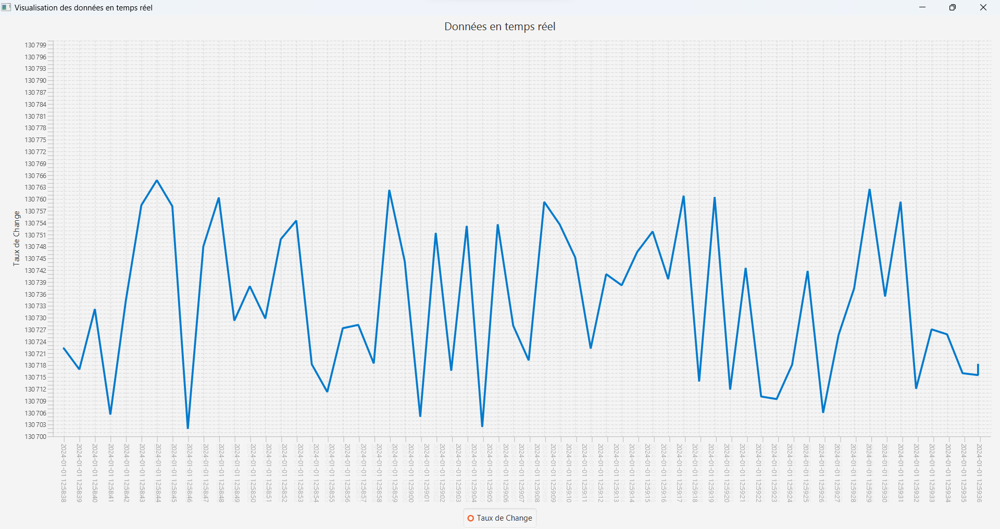
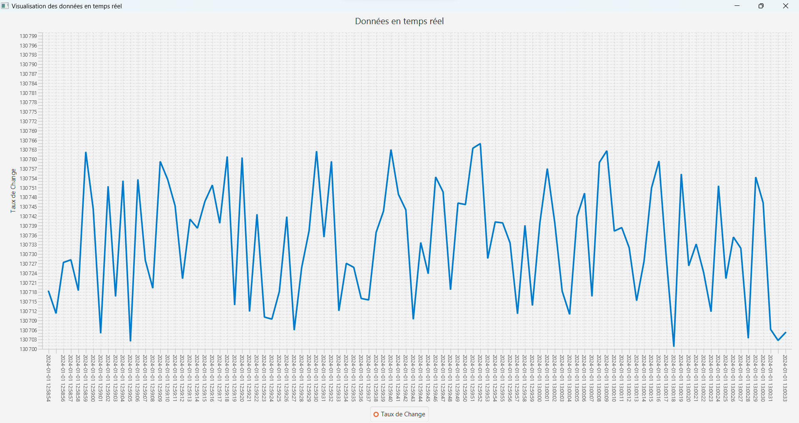

# Exchange Rate Streaming Job with Sliding Windows
# Carried Out By :
- Ghassen DAOUD
- Med Hedi BELKADHI
- Ahmed Yassine MOKADDEM

This project implements a Flink streaming job that processes exchange rate data using a sliding window operation. The job reads data from an AlphaVantageAPI source and applies a sliding window operation with a fixed window size of 10 seconds and a slide interval of 5 seconds. Within each window, the exchange rate data is multiplied by 2 and then aggregated using the reduce operation, which sums up the values in the window. The aggregated data is then printed to the console.

# Objectif
- Retrieve real-time Bitcoin-to-TND exchange rate data from the AlphVintage API.
- Process the streaming data in real-time using Apache Flink for analytics and transformative operations.
- Implement sliding window operations to detect related data.
- Visualize the processed data dynamically through a line chart interface developed using JavaFX.

# Requirements
To run this project, you will need:

- Java 11 or higher
- JavaFx 17.0.9
- Apache Flink streaming API
- AlphaVantageAPI source

# SetUp
- Open the project in your preferred IDE or text editor.
- Modify the DataStreaming.java file to specify the correct input source and window parameters if needed.
- Build the project using your preferred build tool or using the command line.
- Run the DataStreaming class or the RealTimeDataViz class to initiate the streaming job and visualize the streamed data in real-time.

# Usage
Once the streaming job is running, it will read data from the AlphaVantageAPI source and apply a sliding window operation with a fixed window size of 10 seconds and a slide interval of 5 seconds. Within each window, the exchange rate data is multiplied by 2 and then aggregated using the reduce operation, which sums up the values in the window. The aggregated data is then printed to the console.

To stop the streaming job, you can terminate the job using the CTRL+C command or by stopping the Flink cluster.

# Sliding window
**Real-time Data Processing with Flink and Dynamic Windows**

In our dynamic data streaming project, the implementation of sliding windows using Apache Flink's powerful streaming API plays a pivotal role in achieving real-time analytics with finesse. A sliding window, defined with a meticulous balance of window size and slide interval, acts as an intelligent buffer, gracefully accommodating the continuous influx of data in a controlled fashion.

The Flink code snippet elegantly captures this essence, orchestrating a dance of temporal precision. With a fixed window size of 10 seconds and a slide interval of 5 seconds, our streaming application adeptly processes incoming data, ensuring both accuracy and responsiveness.

Consider a scenario where cryptocurrency exchange rates arrive at distinct timestamps. The sliding window operation efficiently groups these rates, allowing dynamic computations within each window. As the window glides forward every 5 seconds, it seamlessly incorporates new data, paving the way for a continuous and precise analysis.

Within each temporal window, the exchange rate data undergoes transformative operations—doubling through a map operation and engaging in a symphony of aggregation via a reduce operation. This orchestrated dance culminates in the harmonious presentation of aggregated data, echoing the rhythm of real-time insights, elegantly printed to the console.

This dynamic choreography of sliding windows, embedded within the Flink streaming paradigm, not only showcases the flexibility of our real-time data processing but also lays the foundation for responsive and accurate analytics in the ever-evolving landscape of streaming data. Embrace the power of dynamic windows and let your data dance to the beat of real-time insights!

# Exchange Rates Plotting (Bitcoin to TND)

